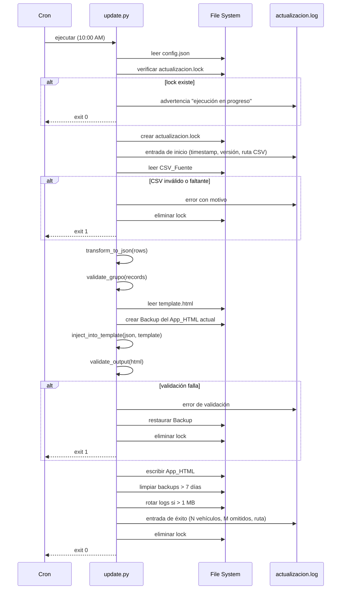

# Design Document

## Inventario Autostar — Auto-Actualización Diaria

---

## Overview

El pipeline de auto-actualización es un script de línea de comandos (Python 3) que se ejecuta diariamente a las 10:00 AM mediante cron. Su trabajo es leer un CSV exportado manualmente desde AppSheet, transformar cada fila al esquema JSON que espera `inventario_autostar.html`, y regenerar el archivo HTML con los datos frescos, manteniendo intacta toda la interfaz visual y la lógica de filtrado.

La filosofía de diseño es **sin infraestructura de servidor**: todo ocurre localmente en el equipo del administrador. No hay base de datos, no hay API, no hay proceso daemon. El único efecto del script es sobrescribir un archivo HTML en disco.

### Flujo de alto nivel

```
CSV en disco ──► validate_csv() ──► transform_to_json() ──► inject_into_template() ──► inventario_autostar.html
                      │                     │                         │
                      ▼                     ▼                         ▼
                 Log de errores      Log de omisiones          Backup previo
```

---

## Architecture

El sistema se compone de cuatro piezas:

1. **`update.py`** — Script principal. Orquesta todas las fases en secuencia.
2. **`template.html`** — Copia del HTML con `const DATA = [/*%%DATA%%*/]` como marcador de posición.
3. **`config.json`** — Archivo de configuración con las rutas de todos los artefactos.
4. **Cron entry** — Entrada en crontab del sistema operativo que dispara `update.py` a las 10:00 AM.

```
/Users/javiereli/InventAutoStar/
├── inventario_autostar.html   ← App_HTML (output final, leído y sobrescrito)
├── template.html              ← Template_HTML (solo lectura)
├── config.json                ← Configuración (rutas)
├── update.py                  ← Script_Actualizacion
├── actualizacion.log          ← Log_Actualizacion
├── actualizacion.lock         ← Archivo de lock (efímero)
└── backups/
    ├── inventario_autostar_20260120_100012.html
    └── inventario_autostar_20260121_100008.html
```

### Diagrama de secuencia



---

## Components and Interfaces

### `update.py` — módulos internos

El script está organizado en funciones puras cuando es posible, para facilitar el testing.

#### `load_config(script_dir: Path) -> dict`

Lee `config.json` desde `script_dir`. Si no existe, lo crea con defaults y termina. Si le faltan campos, imprime los faltantes y termina. Resuelve rutas relativas contra `script_dir`. Verifica accesibilidad de directorios padres.

```python
def load_config(script_dir: Path) -> dict:
    ...
# Retorna: {"csv_path": Path, "html_output_path": Path,
#           "template_path": Path, "backup_dir": Path, "log_path": Path}
```

#### `validate_csv(csv_path: Path) -> list[dict]`

Valida existencia, tamaño > 0 y presencia de columnas obligatorias. Retorna lista de dicts con las filas crudas del CSV.

```python
REQUIRED_COLUMNS = {"vin","inv","desc","anio","kms","color","precio","tipo","estatus","grupo"}

def validate_csv(csv_path: Path) -> list[dict]:
    ...
# Lanza: ConfigError, CSVError con mensaje descriptivo
```

#### `transform_row(raw: dict) -> dict`

Transforma una fila cruda del CSV en un objeto JSON del inventario. Función pura sin side effects. Aplica todas las reglas de coerción de tipos.

```python
def transform_row(raw: dict) -> dict:
    ...
# Retorna objeto con: vin, inv, desc, anio, kms, color, precio, bono,
# garantia, ubicacion, grupo, condicion, link, tipo, estatus,
# foraneo, cil, lts, trans
```

**Reglas de coerción:**

| Campo | Tipo destino | Regla de fallo |
|-------|-------------|----------------|
| `precio` | `float` | Si no parseable como decimal → `0.0` |
| `kms` | `int` | Si no parseable como entero ≥ 0 → `0` |
| `bono`, `garantia`, `condicion`, `link`, `foraneo`, `cil`, `lts`, `trans` | `str` | Si vacío → `""` |
| Todos los demás | `str` | Trim de espacios |

#### `filter_and_deduplicate(rows: list[dict]) -> tuple[list[dict], list[int], list[str]]`

Elimina filas con `vin` vacío y filas con `vin` duplicado (conserva la primera ocurrencia). Retorna `(records_válidos, índices_omitidos_por_vacío, vins_duplicados)`.

```python
def filter_and_deduplicate(rows: list[dict]) -> tuple[list[dict], list[int], list[str]]:
    ...
```

#### `normalize_grupo(records: list[dict]) -> list[dict]`

Valida que el campo `grupo` de cada registro sea `"Mexicali"`, `"Tijuana"` o `"Otro"`. Si no, lo corrige a `"Otro"` y registra el VIN y el valor inválido.

```python
VALID_GRUPOS = {"Mexicali", "Tijuana", "Otro"}

def normalize_grupo(records: list[dict]) -> tuple[list[dict], list[tuple[str, str]]]:
    ...
# Retorna: (records_normalizados, [(vin, grupo_invalido), ...])
```

#### `inject_into_template(template_content: str, json_data: str, update_date: date) -> str`

Reemplaza `/*%%DATA%%*/` en el template con `json_data`. Actualiza el texto del footer con la fecha en formato `DD MMM YYYY` en español. Valida que hay exactamente una ocurrencia del placeholder.

```python
PLACEHOLDER = "/*%%DATA%%*/"
MONTH_ABBR_ES = ["ene","feb","mar","abr","may","jun","jul","ago","sep","oct","nov","dic"]

def inject_into_template(template_content: str, json_data: str, update_date: date) -> str:
    ...
# Lanza: TemplateError si placeholder no aparece exactamente una vez
```

#### `validate_output(html_content: str) -> None`

Verifica que el HTML generado contiene `const DATA = [` seguido de al menos un elemento y que el tamaño es > 10 KB.

```python
def validate_output(html_content: str) -> None:
    ...
# Lanza: OutputValidationError con detalle
```

#### `create_backup(html_path: Path, backup_dir: Path) -> Path`

Copia el App_HTML actual a `backup_dir` con sufijo `_YYYYMMDD_HHMMSS`. Verifica que el backup resultante tiene el mismo tamaño en bytes que el original.

```python
def create_backup(html_path: Path, backup_dir: Path) -> Path:
    ...
# Retorna: ruta del backup creado
```

#### `cleanup_backups(backup_dir: Path) -> None`

Elimina backups cuya marca de tiempo sea anterior a `now - 7 días` (a las 00:00:00).

```python
def cleanup_backups(backup_dir: Path) -> None:
    ...
```

#### `setup_logger(log_path: Path) -> logging.Logger`

Configura el logger. Si el archivo de log supera 1 MB, lo rota agregando sufijo ISO 8601 y crea uno nuevo. Si ya hay ≥ 5 archivos rotados previos, elimina el más antiguo antes de crear el nuevo.

```python
def setup_logger(log_path: Path) -> logging.Logger:
    ...
```

### `template.html`

Copia del `inventario_autostar.html` actual donde la línea:

```javascript
const DATA = [...];
```

se reemplaza por:

```javascript
const DATA = [/*%%DATA%%*/];
```

Y la línea del footer queda como:

```html
<footer>Datos cargados de AppSheet · %%FECHA%% · Los precios y disponibilidad pueden cambiar; verifica antes de ofertar al cliente.</footer>
```

> **Nota:** El placeholder de la fecha es `%%FECHA%%` dentro del footer, no parte del bloque DATA.

### `config.json`

```json
{
  "csv_path": "./inventario.csv",
  "html_output_path": "./inventario_autostar.html",
  "template_path": "./template.html",
  "backup_dir": "./backups",
  "log_path": "./actualizacion.log"
}
```

Todos los campos son obligatorios. Las rutas relativas se resuelven contra la ubicación del `config.json`.

---

## Data Models

### Columnas del CSV_Fuente

| Columna | Requerida | Tipo en CSV |
|---------|-----------|-------------|
| `vin` | Sí | string |
| `inv` | Sí | string |
| `desc` | Sí | string |
| `anio` | Sí | string |
| `kms` | Sí | string (número) |
| `color` | Sí | string |
| `precio` | Sí | string (número, puede tener `$`, `,`) |
| `bono` | No | string |
| `garantia` | No | string |
| `ubicacion` | No | string |
| `grupo` | Sí | string |
| `condicion` | No | string |
| `link` | No | string |
| `tipo` | Sí | string |
| `estatus` | Sí | string |
| `foraneo` | No | string |
| `cil` | No | string |
| `lts` | No | string |
| `trans` | No | string |

### Esquema del objeto JSON_Inventario (por registro)

```json
{
  "vin":       "RT103350",
  "inv":       "5184",
  "desc":      "SUZUKI GRAND VITARA GLX",
  "anio":      "2024",
  "kms":       39159,
  "color":     "AZUL",
  "precio":    335000.0,
  "bono":      "",
  "garantia":  "VALIDAR",
  "ubicacion": "AUTOSTAR TJ",
  "grupo":     "Tijuana",
  "condicion": "Financiera/Banco con convenio",
  "link":      "",
  "tipo":      "SUV SUBCOMPACTAS",
  "estatus":   "DISPONIBLE",
  "foraneo":   "N",
  "cil":       "4",
  "lts":       "1.5",
  "trans":     "AUT"
}
```

Tipos exactos:
- `kms` → `int`
- `precio` → `float`
- Todos los demás → `str`

### Estructura del Log

Cada línea sigue el formato de `logging` estándar de Python:

```
2026-08-20T10:00:01 INFO  [inicio] v1.0.0 | csv=/Users/.../inventario.csv
2026-08-20T10:00:02 INFO  [csv] 85 filas leídas, 2 omitidas (vacíos: filas 12,45), 1 duplicada (vin: XXXX)
2026-08-20T10:00:02 WARN  [csv] 3 registros con grupo inválido: [{vin: ABC, grupo: "Ensenada"}, ...]
2026-08-20T10:00:03 INFO  [output] 82 vehículos procesados | html=/Users/.../inventario_autostar.html
2026-08-20T10:00:03 INFO  [fin] éxito
```

---

## Correctness Properties

*Una propiedad es una característica o comportamiento que debe cumplirse en todas las ejecuciones válidas del sistema — esencialmente, un enunciado formal sobre lo que el sistema debe hacer. Las propiedades sirven de puente entre las especificaciones legibles por humanos y las garantías de corrección verificables por máquina.*

### Property 1: Columnas faltantes siempre detectadas

*Para cualquier* archivo CSV cuyo encabezado sea un subconjunto arbitrario de columnas, si falta alguna de las columnas obligatorias (`vin, inv, desc, anio, kms, color, precio, tipo, estatus, grupo`), el script debe reportar exactamente el conjunto de columnas faltantes y abortar sin modificar el App_HTML.

**Validates: Requirements 1.4, 1.5**

---

### Property 2: Precio inválido normalizado a 0.0

*Para cualquier* string en el campo `precio` que no pueda interpretarse como número decimal (vacío, solo espacios, con símbolos arbitrarios, texto no numérico), el campo `precio` del objeto JSON resultante debe ser exactamente `0.0`.

**Validates: Requirements 2.2**

---

### Property 3: Kilometraje inválido normalizado a 0

*Para cualquier* string en el campo `kms` que no pueda interpretarse como entero no negativo, el campo `kms` del objeto JSON resultante debe ser exactamente `0`.

**Validates: Requirements 2.3**

---

### Property 4: Campos opcionales vacíos producen string vacío

*Para cualquier* combinación de campos opcionales (`bono, garantia, condicion, link, foraneo, cil, lts, trans`) que estén vacíos en el CSV, el objeto JSON resultante debe tener exactamente `""` en esos campos.

**Validates: Requirements 2.4**

---

### Property 5: JSON producido siempre es parseable

*Para cualquier* CSV con al menos una fila válida (vin no vacío, columnas obligatorias presentes), el string JSON producido por `transform_row` debe ser parseable por `json.loads()` sin lanzar excepción.

**Validates: Requirements 2.5**

---

### Property 6: Filas con VIN vacío siempre omitidas y registradas

*Para cualquier* CSV con N filas cuyo campo `vin` esté vacío (en posiciones arbitrarias), el JSON_Inventario resultante no debe contener ninguna de esas filas, y el log debe indicar exactamente N como cantidad de filas omitidas junto con sus índices de fila en el CSV (contando desde 1, sin encabezado).

**Validates: Requirements 2.6**

---

### Property 7: VINs duplicados: solo la primera ocurrencia

*Para cualquier* CSV que contenga K filas con el mismo valor no-vacío de `vin`, el JSON_Inventario resultante debe contener exactamente una ocurrencia de ese `vin` (la primera encontrada), y el log debe reportar K-1 duplicados omitidos con su valor de `vin`.

**Validates: Requirements 2.8**

---

### Property 8: Grupo siempre en valores válidos

*Para cualquier* conjunto de registros con valores arbitrarios en el campo `grupo`, el JSON_Inventario resultante debe tener todos los registros con `grupo` ∈ `{"Mexicali", "Tijuana", "Otro"}`. Cualquier registro cuyo `grupo` original no estuviera en ese conjunto debe tener `"Otro"` como valor final, y el log debe contener el VIN y el valor inválido original para cada corrección.

**Validates: Requirements 7.6, 7.7**

---

### Property 9: Formato de fecha del footer

*Para cualquier* fecha válida del calendario, el texto del footer generado por `inject_into_template` debe usar exactamente el formato `DD MMM YYYY` donde DD tiene siempre dos dígitos (con cero a la izquierda si es necesario), MMM es la abreviatura española correcta para ese mes, y YYYY es el año con cuatro dígitos.

**Validates: Requirements 3.4**

---

### Property 10: Estructura del template preservada

*Para cualquier* template HTML válido que contenga exactamente un placeholder `/*%%DATA%%*/`, el HTML generado debe contener todos los mismos bloques de CSS, HTML estructural y JavaScript del template, con la única diferencia siendo el contenido del array `DATA` y el texto del footer con la fecha.

**Validates: Requirements 7.1, 3.3**

---

### Property 11: Campos faltantes de config.json siempre reportados

*Para cualquier* subconjunto de los cinco campos requeridos (`csv_path`, `html_output_path`, `template_path`, `backup_dir`, `log_path`) que estén ausentes en un `config.json`, el script debe imprimir en consola exactamente los nombres de los campos faltantes y terminar sin realizar el proceso de actualización.

**Validates: Requirements 6.3**

---

### Property 12: Backups de más de 7 días siempre eliminados

*Para cualquier* conjunto de archivos de backup en `backup_dir` con marcas de tiempo arbitrarias, después de ejecutar `cleanup_backups`, deben permanecer exactamente los backups cuya marca de tiempo sea mayor o igual a `(fecha_actual - 7 días) a las 00:00:00`, y deben eliminarse todos los que sean anteriores a ese umbral.

**Validates: Requirements 3.7**

---

### Property 13: Rotación de logs conserva máximo 5 archivos rotados

*Para cualquier* número N de archivos de log rotados existentes, si N ≥ 5 y se dispara una nueva rotación, después de la rotación deben existir exactamente 5 archivos de log rotados (el más antiguo habrá sido eliminado antes de crear el nuevo).

**Validates: Requirements 5.6**

---

## Error Handling

### Jerarquía de excepciones

```
AutostarError (base)
├── ConfigError        — config.json faltante/inválido/rutas inaccesibles
├── LockError          — proceso ya en ejecución
├── CSVError           — CSV faltante, vacío, columnas inválidas
├── TemplateError      — placeholder no encontrado o múltiple
├── BackupError        — no se pudo crear/verificar el backup
├── OutputValidationError — HTML generado no pasa validaciones
└── WriteError         — error durante escritura del App_HTML
```

### Política de errores por fase

| Fase | Error | Acción |
|------|-------|--------|
| Lectura de config | `ConfigError` | Imprimir en consola, exit 1, NO crear lock |
| Lock check | `LockError` | Log warning, exit 0 |
| Lectura CSV | `CSVError` | Log error, eliminar lock, exit 1 |
| Transformación | Excepción inesperada | Log error con traceback, eliminar lock, exit 1 |
| Backup | `BackupError` | Log error, NO sobrescribir HTML, eliminar lock, exit 1 |
| Validación output | `OutputValidationError` | Log error, restaurar backup si aplica, eliminar lock, exit 1 |
| Escritura HTML | `WriteError` | Restaurar backup, verificar integridad, log error, eliminar lock, exit 1 |

### Garantía de cleanup del lock

El bloque principal usa `try/finally` para garantizar que `actualizacion.lock` siempre se elimina, incluso si ocurre una excepción no anticipada:

```python
try:
    lock_path.touch()
    run_pipeline(config, logger)
except SystemExit:
    raise
except Exception as e:
    logger.error(f"[fatal] error inesperado: {e}", exc_info=True)
    sys.exit(1)
finally:
    if lock_path.exists():
        lock_path.unlink()
```

### Validación de integridad de backup

Antes de restaurar un backup, el script verifica que el archivo de backup tiene el mismo tamaño en bytes que tenía el original al momento de copiarlo. Si la verificación falla, registra el error pero no intenta una restauración corrupta.

---

## Testing Strategy

### Herramientas

- **Framework de unit tests**: `pytest` (estándar de Python)
- **Framework de property-based testing**: `hypothesis` (biblioteca madura, ampliamente usada)
- **Mocking**: `unittest.mock` (stdlib)
- **Cobertura**: `pytest-cov`

### Estructura de archivos de tests

```
/Users/javiereli/InventAutoStar/
└── tests/
    ├── conftest.py              ← fixtures compartidos (tmp_dir, sample CSV, template)
    ├── test_config.py           ← tests de load_config (unit + property)
    ├── test_csv_validation.py   ← tests de validate_csv (unit + property)
    ├── test_transform.py        ← tests de transform_row, filter_and_deduplicate (unit + property)
    ├── test_normalize.py        ← tests de normalize_grupo (unit + property)
    ├── test_template.py         ← tests de inject_into_template, validate_output (unit + property)
    ├── test_backup.py           ← tests de create_backup, cleanup_backups (unit + property)
    ├── test_logging.py          ← tests de setup_logger (unit + property)
    └── test_integration.py      ← tests end-to-end con filesystem real (tmp_dir)
```

### Tests de propiedad (Hypothesis)

Cada propiedad del diseño se implementa con un test de Hypothesis con mínimo 100 iteraciones.

```python
# Ejemplo: Property 2 — precio inválido → 0.0
# Feature: inventario-autostar-auto-actualizacion, Property 2: precio inválido normalizado a 0.0
from hypothesis import given, settings
from hypothesis import strategies as st

INVALID_PRECIO = st.one_of(
    st.just(""),
    st.text(max_size=20).filter(lambda s: not _can_parse_float(s)),
    st.builds(lambda n, s: f"${n:,.2f}" if s else f"{n}",
              st.floats(min_value=0), st.booleans()),
)

@given(precio_str=INVALID_PRECIO)
@settings(max_examples=200)
def test_precio_invalido_produce_cero(precio_str):
    row = {**SAMPLE_ROW_VALID, "precio": precio_str}
    result = transform_row(row)
    assert result["precio"] == 0.0
```

```python
# Property 6 — VINs vacíos omitidos y registrados
# Feature: inventario-autostar-auto-actualizacion, Property 6: filas con VIN vacío omitidas y registradas
@given(rows=st.lists(csv_row_strategy(), min_size=1, max_size=50),
       empty_indices=st.lists(st.integers(min_value=0), max_size=10))
@settings(max_examples=200)
def test_filas_vin_vacio_omitidas(rows, empty_indices):
    # forzar vin vacío en los índices dados (dentro de rango)
    for i in empty_indices:
        if i < len(rows):
            rows[i] = {**rows[i], "vin": ""}
    result, omitted_indices, _ = filter_and_deduplicate(rows)
    expected_omitted = [i for i, r in enumerate(rows) if not r["vin"].strip()]
    assert all(r["vin"].strip() != "" for r in result)
    assert sorted(omitted_indices) == sorted(expected_omitted)
```

### Tests de ejemplo (unit tests)

Complementan las propiedades con casos concretos y de borde:

```python
# Req 1.2 — CSV inexistente aborta sin tocar HTML
def test_csv_no_existente_aborta(tmp_path):
    config = make_config(tmp_path, csv_path=tmp_path / "noexiste.csv")
    html_before = read_html(config["html_output_path"])
    result = run_script(config)
    assert result.returncode == 1
    assert "noexiste.csv" in read_log(config["log_path"])
    assert read_html(config["html_output_path"]) == html_before

# Req 4.5 — lock existente aborta con exit 0
def test_lock_existente_exit_cero(tmp_path):
    config = make_config(tmp_path)
    (tmp_path / "actualizacion.lock").touch()
    result = run_script(config)
    assert result.returncode == 0
    assert "ejecución en progreso" in read_log(config["log_path"])

# Req 3.6 — error de escritura restaura backup
def test_error_escritura_restaura_backup(tmp_path, monkeypatch):
    config = make_config(tmp_path)
    original_content = read_html(config["html_output_path"])
    monkeypatch.setattr("builtins.open", fail_on_write)
    run_script(config)
    assert read_html(config["html_output_path"]) == original_content
```

### Tests de integración

Ejecutan el script completo en un directorio temporal con archivos reales:

```python
def test_end_to_end_actualizacion(tmp_path):
    """Dado un CSV válido con 10 vehículos, el HTML generado
    debe contener exactamente 10 registros en DATA."""
    setup_full_environment(tmp_path, num_vehicles=10)
    result = subprocess.run(["python3", "update.py"], cwd=tmp_path)
    assert result.returncode == 0
    html = (tmp_path / "inventario_autostar.html").read_text()
    data = extract_json_data(html)
    assert len(data) == 10

def test_dry_run_no_modifica_html(tmp_path):
    setup_full_environment(tmp_path)
    html_before = (tmp_path / "inventario_autostar.html").read_text()
    subprocess.run(["python3", "update.py", "--dry-run"], cwd=tmp_path)
    assert (tmp_path / "inventario_autostar.html").read_text() == html_before
```

### Configuración de Hypothesis

```python
# conftest.py
from hypothesis import settings, HealthCheck

settings.register_profile("ci", max_examples=200, suppress_health_check=[HealthCheck.too_slow])
settings.register_profile("dev", max_examples=50)
settings.load_profile("ci")
```

### Comandos para correr los tests

```bash
# Instalar dependencias de test
pip install pytest hypothesis pytest-cov

# Correr todos los tests
pytest tests/ -v

# Correr solo property tests
pytest tests/ -v -k "property"

# Correr con cobertura
pytest tests/ --cov=update --cov-report=term-missing
```

> **Nota:** Para ejecutar los tests en modo watch durante desarrollo, usa `pytest-watch`:
> `pip install pytest-watch && ptw tests/`
> (Córrelo manualmente en tu terminal — no como proceso del script de actualización.)
